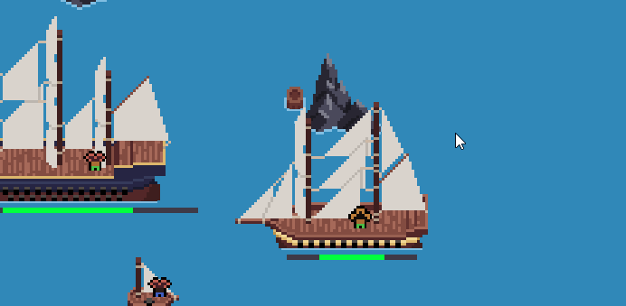

# ZeroGdk (Game Development Kit)

A high-performance C# client-server library powering live multiplayer games. Offering advanced connection management, an Arch-based ECS, and real-time entity networking for scalable multiplayer game servers.